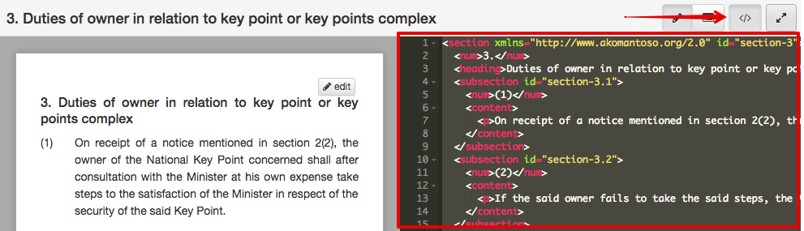
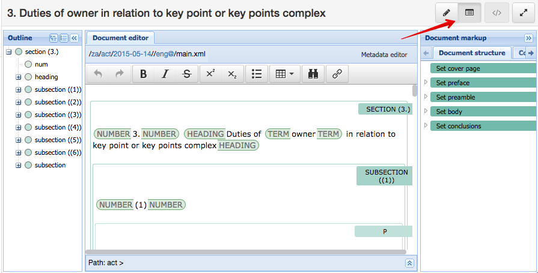

.. _editing:

Editing Documents
=================

If you're capturing a new document we recommend first capturing it using a standard word processor like Microsoft Word. Once you have the bulk of the document, import it into Indigo.

Indigo looks for structure in a document by looking for keywords such as *chapter* and *part*. It can identify different aspects of a document:

- Preface
- Preamble
- Parts and chapters
- Sections, subsections and numbered lists
- Schedules

.. note::

    Indigo ignores presentation details such as font size, bold and italicised text, and indentation because those elements are used inconsistently by different authors. Indigo will apply new presentation rules based on the structure of the document.

Making and Saving Changes
-------------------------

The easiest way to make an edit is to use the Table of Contents on the left part of the document page to find the section in which to make the change.

1. Click on the heading of the part, chapter or section you wish to edit. Choose the smallest element that contains what you wish to change.

    .. image:: edit-choose-section.png

2. Click the **Edit** button in the top right corner of the document.

    .. image:: edit-button.png

3. Indigo will show the simple editor. Notice that the content of the editor is the textual content of the section you're editing, without any formatting and with very simple layout.
4. Make the changes you require.
5. Click the **green tick** at the top-right corner where you clicked the **Edit** button.

    .. image:: edit-inline.png

6. Indigo will process your change and replace the editor with the new content.

   - If you've made an edit Indigo cannot understand, clicking the **green tick** will show an error. Correct your edit and try again.
   - To abandon your changes, click the **X** icon near the green tick.

8. Click the blue **Save** button to save your changes to the server.

    .. image:: edit-save.png

.. note::

    Bear these tips in mind when editing:

    - Indigo can take a long time to process large sections. Choose the smallest containing element when editing.
    - Use the existing content as a guide for how to format new content.

Editing Structure
-----------------

Indigo cares about the structure of a document, not font sizes or layout. This means you need to follow a few simple conventions and Indigo will do all the hard work for you.

Here is an example of the simple formatting used by Indigo::

    Chapter 8 - Environmental management co-operation agreements

    35. Conclusion of agreements

    (1) The Minister and every MEC and municipality, may enter into environmental management co-operation agreements with any person or community for the purpose of promoting compliance with the principles laid down in this Act.

    [[Section 35(1) inserted by section 7 of Act 46 of 2003]]

    (2) Environmental management co-operation agreements must- 

    (a) only be entered into with the agreement of-

    (i) every organ of state which has jurisdiction over any activity to which such environmental management co-operation agreement relates;

    (ii) the Minister and the MEC concerned;

    (b) only be entered into after compliance with such procedures for public participation as may be prescribed by the Minister; and

    (c) comply with such regulations as may be prescribed under section 45.

Indigo understands how to convert this into the XML that represents a chapter, section 35, subsections etc.

Notice that under subsection 1(a) above there is a sublist with items (i) and (ii). We don't bother
trying to indicate that it is a sublist, Indigo will work that out based on the numbering.

You can think of this as focusing on the **content** of the document and using
very simple **presentation** rules guided by a rough understanding of the
**structure**. Compare this with an editor like Word which focuses heavily on the **presentation**
of the content.

Chapters, Parts, Sections, etc.
-------------------------------

Follow these guidelines to tell Indigo about the structure of your document:

- Start the preface like this::

      PREFACE

- Start the preamble like this::

      PREAMBLE

- Start a chapter like this::
      
      Chapter 2 - Interpretation

- Start a part like this::

      Part 1 - Applications

- Start a section like this::

      1. Definitions

- Numbered subsections must have a number in parentheses at the start of the line::

      (1) The content of section 1.

      (2) The content of section 2.

- Subsections or statements without numbers can be written as-is::

      A statement without a number.

- Numbered sublists must have a number in parentheses at the start of the line::

      (a) sublist item a

      (b) sublist item b

- Start a Schedule like this::

      Schedule 1 - Title
      Heading

The number, ``Title`` and ``Heading`` are optional, you can leave them out if necessary.

Tables
------

Often a piece of legislation will include tables, for example in Schedules. These can be tricky to edit
using the Simple Editor. Indigo uses the same text format for tables that `Wikipedia <http://wikipedia.org/>`_ uses.

.. seealso::

    Be sure to read `Wikipedia's tutorial for writing tables <http://en.wikipedia.org/wiki/Help:Table/Manual_tables>`_.

    Use this `table generator website <http://www.tablesgenerator.com/mediawiki_tables>`_ to easily start building a new table for a document.

    **Don't use** ``class="wikitable"`` even though they recommend it.

This code::

    {|
    |-
    ! header 1
    ! header 2
    ! header 3
    |-
    | row 1, cell 1
    | row 1, cell 2
    | row 1, cell 3
    |-
    | row 2, cell 1
    | row 2, cell 2
    | row 2, cell 3
    |}

produces a table that looks like this:

============= ============= =============
Header 1      Header 2      Header 3
============= ============= =============
row 1, cell 1 row 1, cell 2 row 1, cell 3
row 1, cell 1 row 1, cell 2 row 1, cell 3
============= ============= =============

Notice how we don't explicitly make the header row bold. We simply indicate in the **structure** that those cells
are headers by using ``!`` at the start of the cell's line instead of the normal ``|``. Indigo will format the cell appropriately.

Adding new Chapters, Parts and Sections
---------------------------------------

You can easily add a new chapter, part or section to a document. To do so:

1. edit the chapter, part or section just before where the new one needs to go
2. at the bottom, add the new chapter, part or section heading and content
3. click the green Update button

Downloading PDF and Standalone HTML
-----------------------------------

You can download PDF and standalone (self-contained) HTML versions of a document. These are useful for distribution and archiving. Go to **Preview** and click the **Download** button.

Downloaded and PDF documents can have a *colophon*, which is a page right at the start of the document which contains copyright, ownership and other information. A colophon is automatically chosen for a document based on document's country.

.. note::

    Administrators can add new colophons through the Admin interface. Click on your name in the top-right corner and choose **Site Settings**.

Viewing the XML
---------------

It can be useful to see what the Akoma Ntoso for a piece of the document looks like. Click the **Show Code** button to do this:

Advanced Editing
----------------

Indigo also has an advanced editing mode that uses the `LIME editor <http://lime.cirsfid.unibo.it/>`_ from the creators of Akoma Ntoso. This editor exposes some of the details of the Akoma Ntoso markup structure. It allows you to use the full expressiveness of Akoma Ntoso, but is more complicated to use than the Simple Editor and requires that you understand the Akoma Ntoso format.

To edit a document or section in the Advanced Editor, click the **Advanced Editor** button in the top-right corner near the Simple Editor button.

Editing in the Advanced Editor is like painting with a paintbrush.

1. Write (or cut-and-paste) the content you wish to add
2. Highlight the text you want to mark
3. Click the markup element in the Document Markup pane to mark the highlighted text.

You can preview your changes by changing back to the Simple Editor by clicking the **Simple Editor** button to the left of the **Advanced Editor** button.
