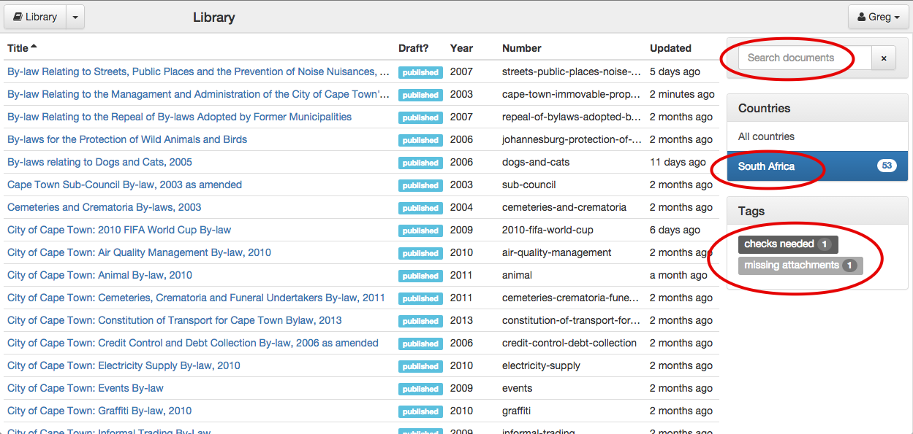

Managing Documents
==================

Library
-------

The library lists all the documents in the system. You can filter them by country and by tag and search for them by title, year and number.

Searching
.........

Search for a document by typing in the search box. This will limit the documents to only those that match your search. Searches ignore case and
match against title, year and number. Clear the search by clicking the **x** button.

Filtering by Country
....................

To show only documents for a particular country click the name of the country in the list on the right.

Filtering by Tag
................

Tags are a powerful way to group and manage documents however you need to. You can add as many tags as you like to a document.

Change a document's tags by clicking on the document name and changing them in the **Basic details** section of the Properties
page.

You can filter the documents to show only those with one or more tags. To do so, click the tag in the list of tags on the right.
The number next to the tag is the number of documents that have that tag. Tags you are filtering by are highlighted in blue.

If you choose to filter by multiple tags, only documents with all of the chosen tags will be shown.

Importing a new document
------------------------

You can create a new document by importing an existing file, such as a PDF or a Word document. Indigo uses
`Apache Tika <https://tika.apache.org/>`_ to import from a wide range of document types, including:

- MS Word (.doc and .docx)
- Rich Text Format (.rtf)
- PDF
- Plain text (.txt)

Simple documents such as Word (.doc) and RTF produce the best results.

.. note::

    Follow these tips for getting the best results when importing documents:

    - Prefer RTF or Word (.doc and .docx) documents; use PDFs only as a last resort
    - Remove the Table of Contents at the start of the document
    - Convert images to text

To import a document:

1. Click the arrow next to the **Library** button and choose **Import a document**.
2. Drag and drop the file to import into the box, or click the button to choose a file to upload.
3. Wait for the document to be imported. This make take up to 10 minutes, especially for large documents.

Once you have imported a document you will need to proof it to ensure that the various components have been correctly captured. Indigo doesn't always get everything right. Look for these errors after importing:

- Check that parts and chapters have been identified correctly.
- Check that numbered sections have been identified correctly.
- Check that numbered lists aren't broken in the wrong places.
- Check that schedules have been matched correctly.

.. seealso::

    See the section on :ref:`editing` for more details.

Indigo will do its best to extract text information from the imported document.
You will still need to fill in all the metadata such as the document title,
year of publication, etc.

Deleting a document
-------------------

You can delete a document by going to the document Properties page and scrolling down to the **Danger Zone** section
and clicking the **Delete this document** button.

.. note:: You cannot delete a published document. Mark it as a draft first.

.. note:: Only users with the **Can delete document** permission can delete a document. An Administrator can change this for you in the Admin area.

.. note::

    If you delete a document by accident an administrator can undelete it for you.

    Administrators: visit ``/admin/indigo_api/document/`` and click on the document to recover, scroll down
    to find the **Deleted** checkbox, uncheck it and click **Save**.
