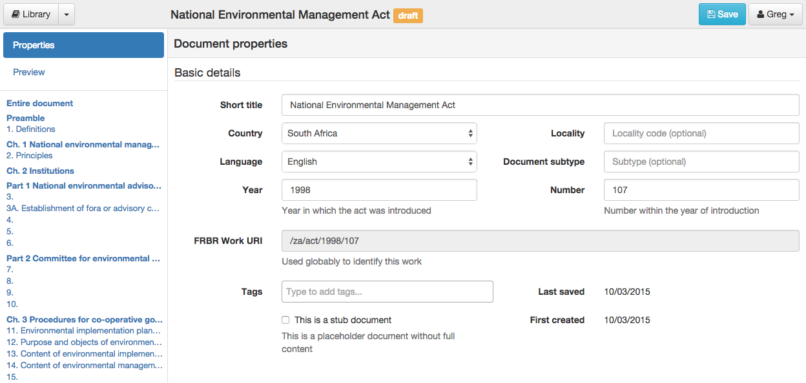

.. _editing_metadata:

Editing Metadata
================

The metadata is important for describing the document and making it available through
the API.

Basic Details
-------------

**Short title** is the generally used title of the document. Most pieces of legislation declare what the short title will be.

**Country** the country that this legislation is applicable to.

**Locality** (optional) the area within the country that this legislation applies to. This is not applicable for national legislation and can be left blank.
If used, this should be a widely accepted code for the region. For example, in South Africa the list of municipality codes is `available on Wikipedia <http://en.wikipedia.org/wiki/List_of_municipalities_in_South_Africa>`_.

**Language** is the language of the document.

**Document subtype** (optional) is the subtype of the document. Choose **(none)** for general Acts.

**Year** is the year of the document, generally the year it was first introduced in Parliament.

**Number** is the number of the document within the year. Most Acts are assigned a sequential number within the year of introduction. If you don't have a number available (eg. for by-laws) use a reasonable short form of the document's name or, as a last resort, use ``nn`` for *not numbered*. Use ``cap123`` for Chapter 123 in a Cap-based numbering system.

**FRBR Work URI** is the URI used to identify this document and is calculated from the other metadata. It uniquely identifies this work. You cannot edit this value.

**Tags** is a free-form collection of tags for this document. Use tags to manage your documents during editing and even after publication. To add a new tag, click in the box, type a new tag and press enter or comma. You can add as many tabs as you like. To delete a tag, either backspace or click the **x** next to the tag's name.

**Stub document** indicates that the document doesn't have all its content yet. This is useful when other documents reference this one but no source is available
or the source has not been fully checked.

.. note::

    Administrators can add new countries, languages and document subtypes through the Admin interface. Click on your name in the top-right corner and choose **Site Settings**.

Promulgation
------------

**Publication date** (optional) is the date on which this document was officially published, in the format ``YYYY-MM-DD``.

**Publication name** (optional) is the name of the publication in which it was published, such as *National Gazette*.

**Publication number** (optional) is the number of the publication in which it was published, such as a gazette number.

**Assent date** (optional) is the date on which the President or other authority assented to the document, in the format ``YYYY-MM-DD``.

**Commencement date** (optional) is the date on which the bulk of the document comes into force, in the format ``YYYY-MM-DD``. If parts of the document come into force on different dates, place an editorial comment inline in the document indicating this.

Draft and Publishing
--------------------

**Draft** controls whether the document is available publically. While you are editing the document, this should be **checked**. Outside users cannot see draft documents. Once a document is ready to be used by outside users, uncheck this box to indicate it is published.

.. note:: You cannot delete a published document. Mark it as a draft, first.

Amendments
----------

The Amendments section records amendments that have been applied to reach **this version of the document**. If you are not editing the latest
version of the document this must only include those amendments that have been applied to reach this point.

To record an amendment, you need the following information about the **amending document** (the document that caused the amendments to happen):

- the title
- date of publication (date at which the amendments took place)
- the FRBR URI of the document

If the amending document is already in the library, you can choose it from the list and have all these details filled in automatically.

To create a newly amended version of a document, edit the version just before the new amendments need to be applied and click **Clone Document**
to create a copy, and then edit that copy.

Attachments
-----------

The Attachments section lets you attach files to your document. This is generally used to link a source PDF, Word or other file with your document, but you can upload any file you like. When creating a new document by importing a file, the file is automatically added as an attachment.

To upload a new file, click on **Attachments** and then click the **Choose Files** button.

You can change the name of an attachment by clicking the pencil (edit) icon.

Defined Terms Analysis
----------------------

Indigo can find defined terms in a document and associate occurrences of a term with its definition. It does this by looking for a section called ``Definitions`` or ``Interpretation`` and looking for sentences that look like definitions. It then looks through the document to find uses of any defined terms it has found.

To find and link terms, click **Analysis** and then **Find and link defined terms**.

When viewing a document, Indigo marks the definition of a defined term **in bold**.

.. important:: Defined terms are lost when a section is edited. It's best to find and link defined terms just before publishing a final document, or after doing a batch of updates.
