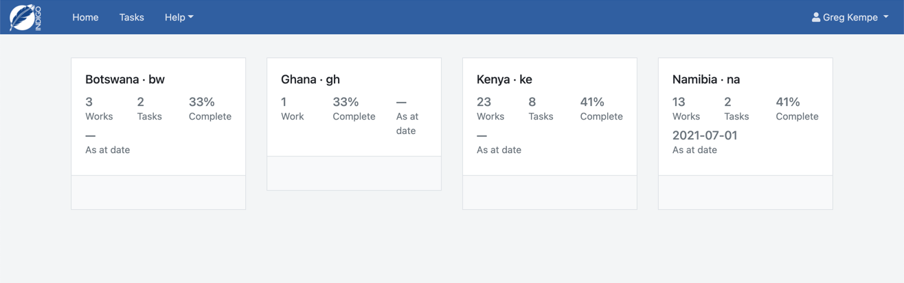
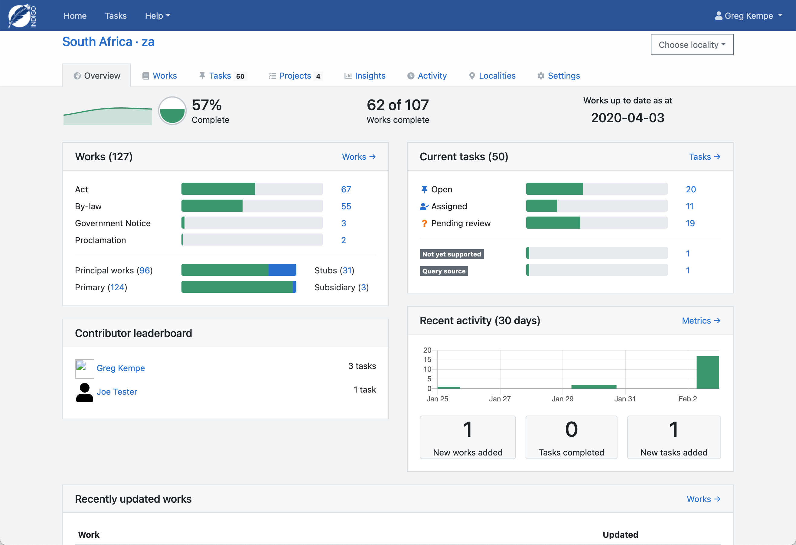

Countries and places
====================

Indigo allows you to manage multiple documents across multiple countries and localities.

A locality is a place within a country, such as a state, province or municipality. You are not limited to these options,
however, and a locality can be anything.

Indigo also supports multiple languages. A country always has a default language.

Choosing a country
------------------

When you open Indigo in your browser, if there is only one country it will always take you to that country. If multiple
countries are configured, it will list the countries and you can choose which one to work with.

Choosing a locality
-------------------

To choose a locality, open the country that the locality is in and then choose the locality from the dropdown
in the top-right corner.

Country overview
----------------

The country overview page provides a summary of the country. Click on the tabs to dive deeper into the country details.
A good place to start is by clicking on the Works tab and creating a new work.

