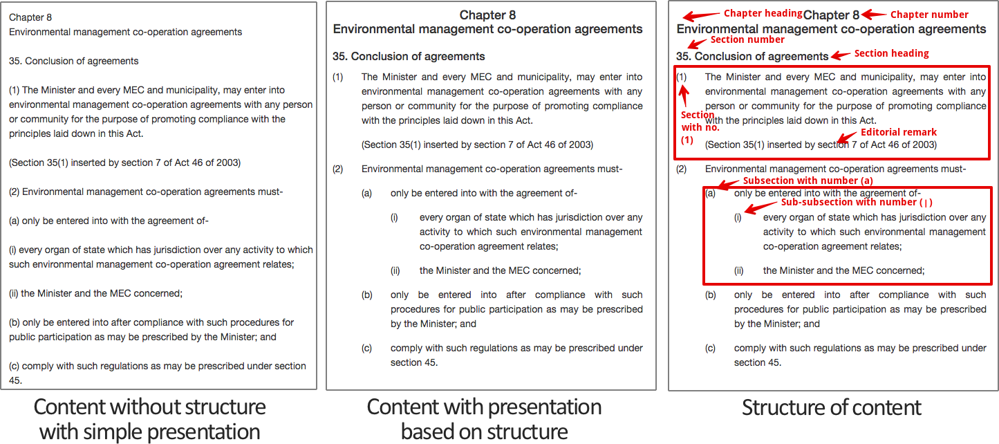
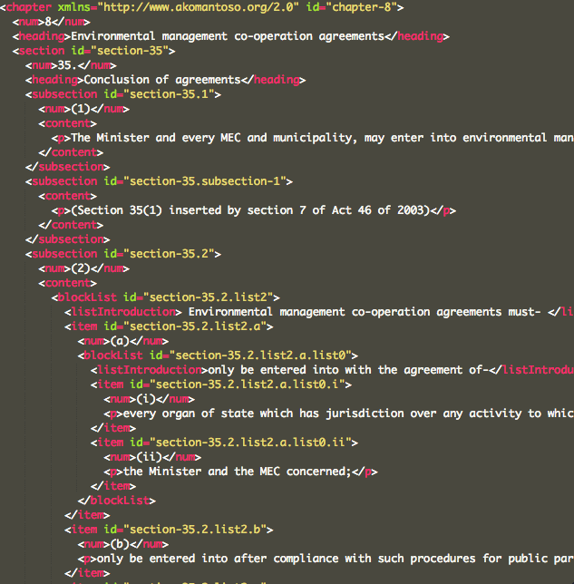

Indigo Principles
=================

The Indigo platform works a bit differently to other consolidation platforms
you might be familiar with. Understanding these differences will help make explain why the Indigo
platform doesn't look like a text editor such as Microsoft Word.

Structure, Content and Presentation 
-----------------------------------

A key goal of the Indigo platform is to allow content to be published for a wide variety of media and devices, including print, desktop web browsers, mobile phones and others that we don't yet know of. It's important that a document can be formatted appropriately for each medium. For example, a printed document will include the Table of Contents at the start of the document, while a web browser and a mobile phone will display the Table of Contents differently to help users navigate the document effectively.

To achieve this, the platform must capture the **metadata**, **content** and **structure** of the document separately from its **presentation**.

- **Metadata** describes the document as a piece of work and includes information such as its title, publication date, language and country. This data allows users to classify, browse and search for documents and is also used when presenting the document.
- **Structure** is the heirarchy of the document, including chapter, part and section information. Capturing the structure makes it possible to provide intuitive user experiences, such as an interface for browsing through a document by section or linking between different sections of a document or between documents.
- **Content** is the actual words of the document, including headings, tables and paragraph numbers, and forms the core of the document.
- **Presentation** is how the document is physically presented to the user and includes typography, layout, colour and formatting.

.. note::

    Notice that presentation is separate from structure and comes *last* in the logical pipeline of managing a document. The same metadata, content and structure can be presented in many different ways.

Here is an example piece of legislation that illustrates the difference between content, structure and presentation.

The Indigo platform focuses on capturing the metadata, structure and content of documents. It provides some support for basic
presentation of a document--primarily HTML--and allows others to build on the captured structure to provide new presentation layers.
This means the hard work done to capture a document in Indigo will keep paying off over time as the support for the underlying
data format grows.

.. note::

    It's more important to capture the **content** and **structure** of a document than exactly match the presentation of the original.

A good example of this separation of content, structure and presentation is the guide you're reading right now. You can read this guide in at least four different forms, each with its own style of presentation:

* `As a website <http://indigo.readthedocs.org/en/latest/guide/>`_
* `As a PDF <http://readthedocs.org/projects/indigo/downloads/pdf/latest/>`_
* `As a single downloadable webpage <http://readthedocs.org/projects/indigo/downloads/htmlzip/latest/>`_
* `As an Epub e-book <http://readthedocs.org/projects/indigo/downloads/epub/latest/>`_

This is all possible because the guide is written using `reStructured Text <http://docutils.sourceforge.net/rst.html>`_, a simple text format for writing documentation that focuses on content and structure and ignores presentation. Here's what the reStructured Text source for this section looks like:::

    Structure, Content and Presentation 
    -----------------------------------

    A key goal of the Indigo platform is to allow content to be published for a wide variety of media and devices, including print, desktop web browsers, mobile phones and others that we don't yet know of. It's important that a document can be formatted appropriately for each medium. For example, a printed document will include the Table of Contents at the start of the document, while a web browser and a mobile phone will display the Table of Contents differently to help users navigate the document effectively.

    To achieve this, the platform must capture the **metadata**, **content** and **structure** of the document separately from its **presentation**.

    - **Metadata** describes the document as a piece of work and includes information such as its title, publication date, language and country. This data allows users to classify, browse and search for documents and is also used when presenting the document.
    - **Structure** is the heirarchy of the document, including chapter, part and section information. Capturing the structure makes it possible to provide intuitive user experiences, such as an interface for browsing through a document by section or linking between different sections of a document or between documents.
    - **Content** is the actual words of the document, including headings, tables and paragraph numbers, and forms the core of the document.
    - **Presentation** is how the document is physically presented to the user and includes typography, layout, colour and formatting.

    .. note::

        Notice that presentation is separate from structure and comes *last* in the logical pipeline of managing a document. The same metadata, content and structure can be presented in many different ways.

    Here is an example piece of legislation that illustrates the difference between content, structure and presentation.

    .. image:: content-vs-structure.png

A **compiler** converts this plain text into the different formats listed above, presenting it in the best way for each format. As the author, all I need to do is ensure the content and the structure are well expressed in the reStructured Text format, and the compiler does all the hard work to make it look good. I don't need to worry about styling the document at all.

.. seealso:: 

    You can see the full reStructuredText source for this guide at https://github.com/Code4SA/indigo/tree/master/docs.

Akoma Ntoso
-----------

Under the hood, Indigo uses the `Akoma Ntoso <http://www.akomantoso.org/>`_ standard for legal documents. This is an XML standard that allows us to capture the content and--most importantly--the structure of the document. Akoma Ntoso supports a wide range of documents (acts, bills, debates, gazettes, etc.) but we only use the **act** document type. Documents such as by-laws, statutory instruments and government notices also fall under this type.

.. seealso::

    See http://www.akomantoso.org/ for more background on Akoma Ntoso.

Akoma Ntoso is designed to support the many varying structures of legislative documents used throughout the world. As a result, the format is rich and expressive but quite complicated. Indigo works with only a subset of what is allowed by Akoma Ntoso and does its best to hide this complexity from the user.

It can be useful to understand what Akoma Ntoso looks like. Here is the XML that corresponds with the content and structure from above:

As you can see, the Akoma Ntoso XML for a section is complicated! If you understand the format you can edit the XML directly, otherwise we recommend you use the editor.

What Indigo Does for You
------------------------

Indigo automates some parts of managing legislation. It can do this because it understands the structure of the document.

1. Indigo generates the cover page for a document based on the metadata you supply. You must not include a cover page in the content of the document.
2. Indigo generates a full Table of Contents with Parts, Chapters, Sections and Schedules. You must not add a Table of Contents to you document; it's important that you don't so that Indigo doesn't get confused.
3. Indigo manages typefaces and font sizes for you. This is a presentation issue and is therefore dependent on what device or media the document is being targeted at. Indigo uses the structural information you provide to decide how the document should look on different devices.
4. Indigo handles indentation for you, based on the document structure. It knows when a subsection is a child of a section and will sort out the indentation appropriately, you don't need to worry. In fact, Indigo completely ignores tabs and spaces when it imports documents.

Next, we'll take you through how to use the Indigo platform to manage and capture legislation.
